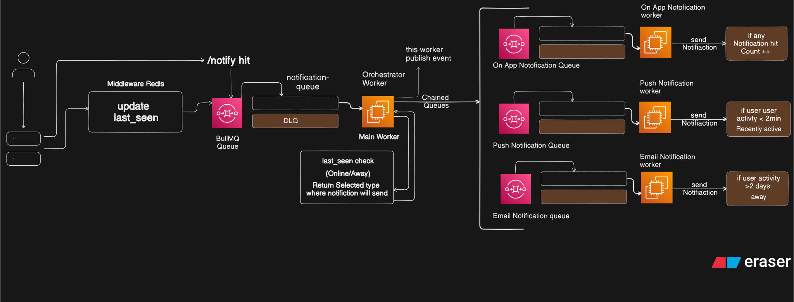

# SwiftNotify: Distributed Notification Engine

SwiftNotify is a robust, scalable, and distributed notification system built with Node.js, BullMQ, and Redis. It intelligently routes messages based on real-time user activity, ensuring the right notification reaches the user through the most appropriate channel.

## Architecture Design

The project follows a Producer-Consumer and Fan-out orchestration pattern:
1. Producer: An Express API endpoint (`/notify`) that ingests notification requests.
2. Orchestrator (Main Worker): Acts as the routing engine. It checks the user's `last_seen` timestamp in Redis and decides where to send the job.
3. Chained Queues: Based on the routing logic, jobs are dispatched to specific delivery queues.
4. Execution Workers: Independent workers process jobs for Push, Email, and In-App delivery.


> **Note:**Below is the visual architecture and logical flow of the system. I designed this engine using a decoupled, event-driven approach. The architecture is entirely stateless and relies on independent message queues



## Intelligent Routing Logic

The system reads the `last_seen` timestamp from Redis to determine user state:
* Active (< 2 mins): Dispatches a Push Notification for immediate engagement.
* Deep Offline (> 2 days): Sends an Email Summary to re-engage the user.
* Default: Updates the In-App Notification count.

## Fault Tolerance & Reliability

* Dead Letter Queues (DLQ): Every queue (Main, Email, Push, In-App) has its own dedicated DLQ. If a job fails after the maximum attempts, it is automatically moved to the DLQ for monitoring and analysis.
* Exponential Backoff: Retries are spaced out (e.g., 5s delay) to handle temporary network glitches.
* Automatic Cleanup: Completed jobs are automatically removed after 1 hour or when the count reaches 100 to keep Redis memory optimized.

## Tech Stack


* Process Management: Concurrently / Nodemon

## Prerequisites

Before you begin, ensure you have the following installed on your machine:
* Node.js (v16 or higher)
* Redis Server (running on default port 6379)

## Installation & Setup

1. Clone the repository:
```bash
git clone https://github.com/awaismaqbool-dev/SwiftNotify--Distributed-Notification-Engine.git
```
2. **Install dependencies:**
Using Npm:

```bash
   npm install

   npm i nodemon
 ```
 3. **Start the development server:**

   ``` start
   npm run dev
   ```


